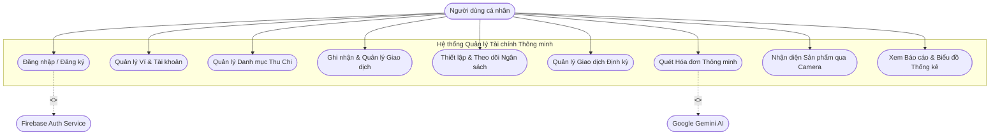
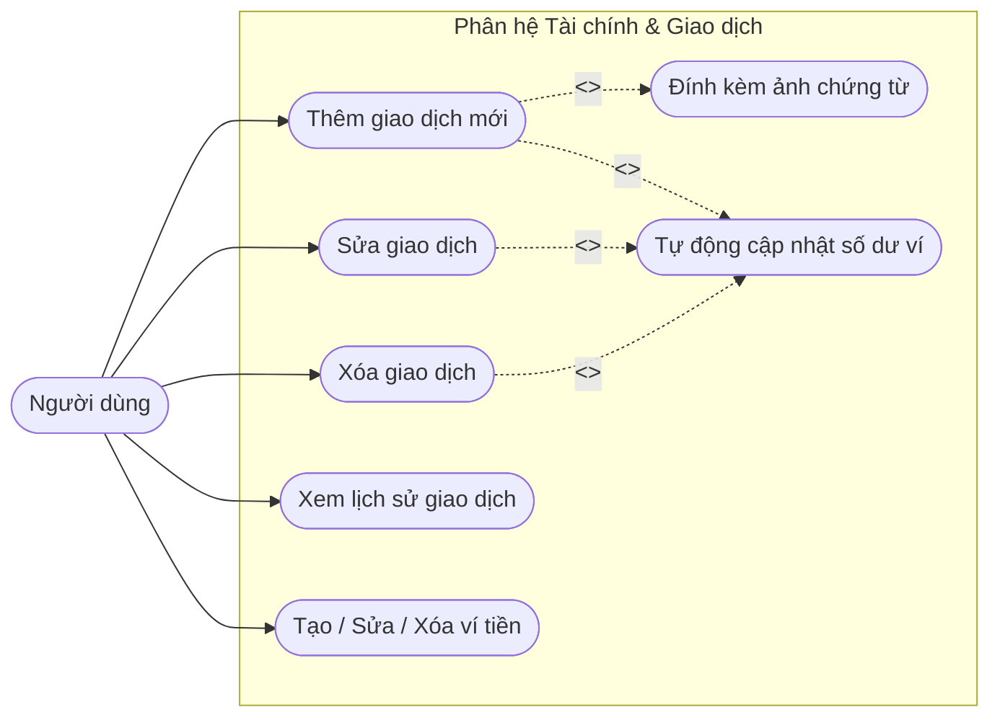
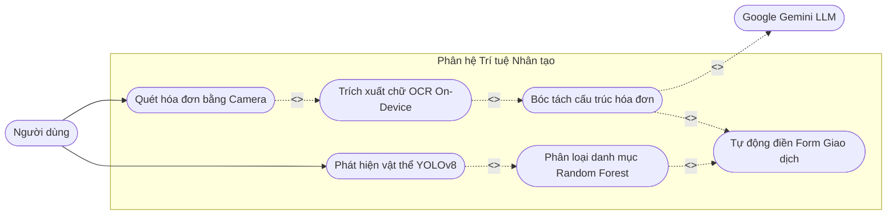
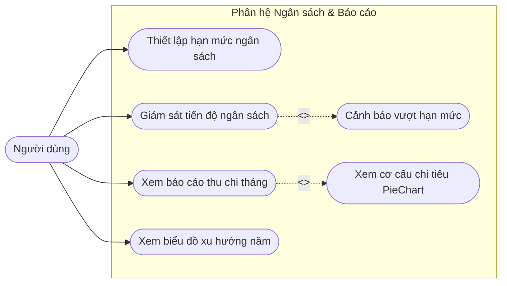
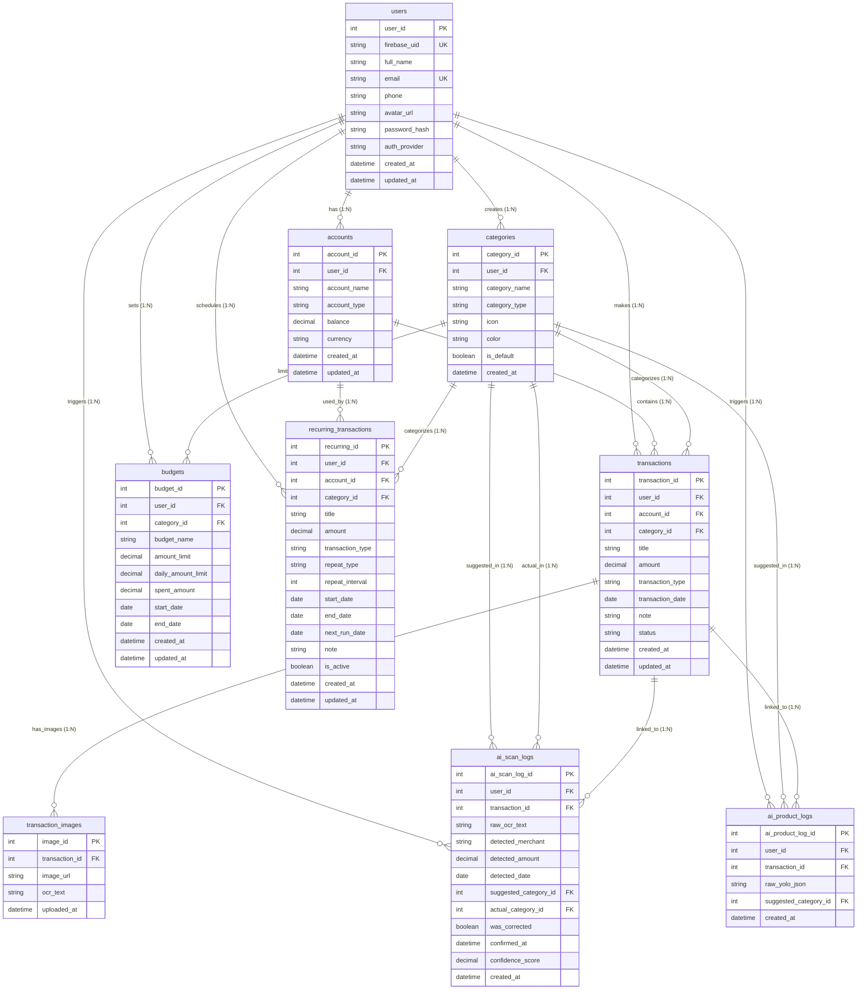
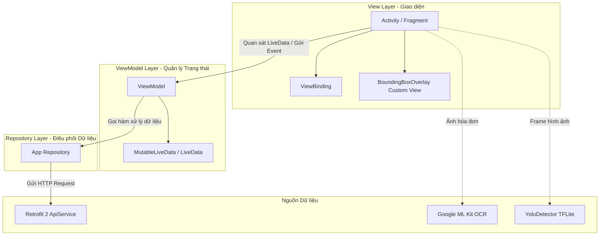
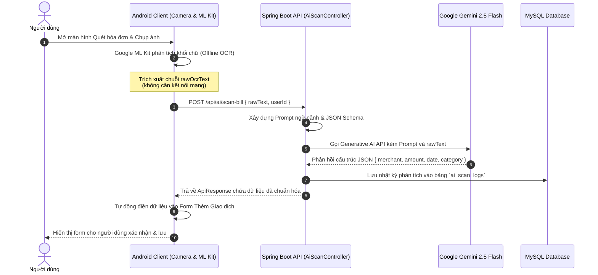
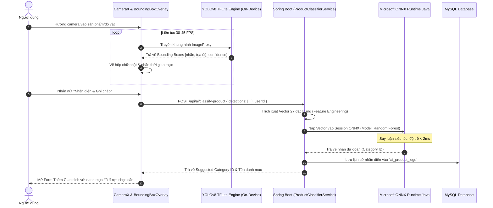
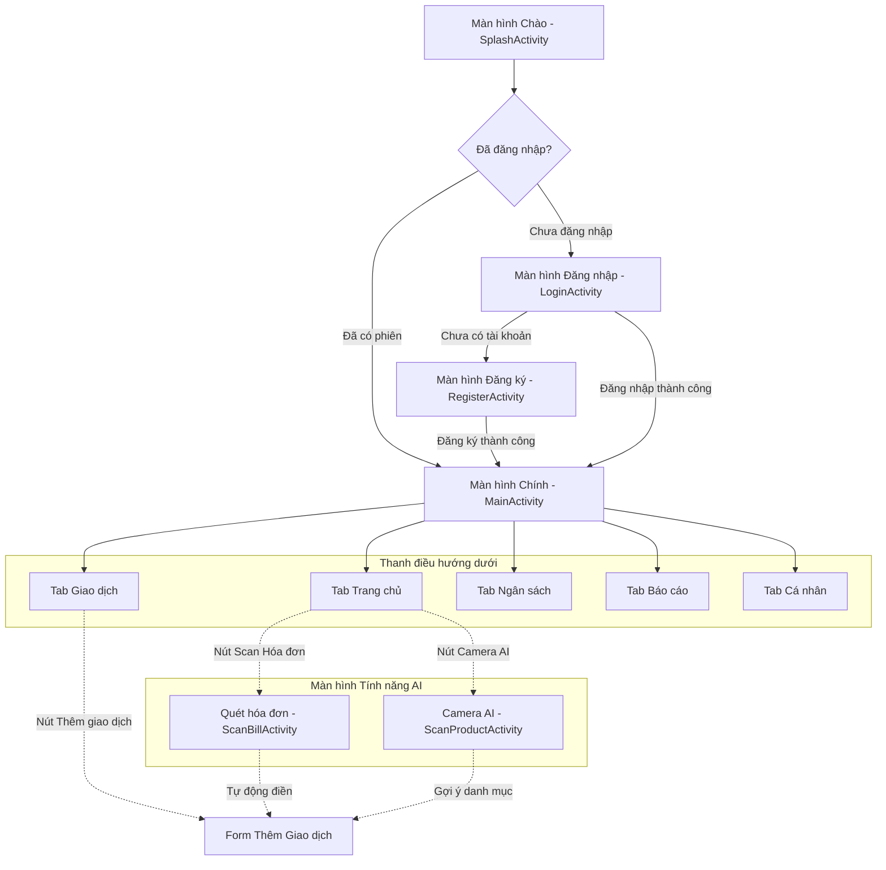

# CHƯƠNG 2: PHÂN TÍCH VÀ THIẾT KẾ HỆ THỐNG

Chương 2 tập trung vào việc phân tích các yêu cầu nghiệp vụ và thiết kế toàn diện kiến trúc hệ thống cho ứng dụng Quản lý Tài chính Cá nhân Thông minh (*Smart Personal Finance App*). Nội dung chương bao gồm: phân tích yêu cầu chức năng và phi chức năng, xây dựng mô hình Use Case, thiết kế cơ sở dữ liệu quan hệ (ERD), thiết kế kiến trúc hệ thống 3 tầng (Android MVVM – Spring Boot REST API – MySQL), thiết kế chi tiết luồng tích hợp Trí tuệ Nhân tạo (Pipeline AI 2 giai đoạn và trích xuất hóa đơn OCR + LLM), thiết kế cơ chế bảo mật xác thực đa tầng và quy hoạch luồng giao diện người dùng.

---

## 2.1. Phân tích yêu cầu hệ thống

Hệ thống được thiết kế nhằm phục vụ nhu cầu ghi chép, giám sát và tối ưu hóa chi tiêu cá nhân của người dùng, đồng thời giải quyết triệt để rào cản nhập liệu thủ công thông qua việc ứng dụng công nghệ Trí tuệ Nhân tạo.

### 2.1.1. Yêu cầu chức năng (Functional Requirements - FR)

Các yêu cầu chức năng của hệ thống được phân rã thành 9 nhóm nghiệp vụ chính:

| Mã FR | Tên phân hệ / Chức năng | Mô tả chi tiết nghiệp vụ | Mức độ ưu tiên |
|:---:|:---|:---|:---:|
| **FR-01** | **Quản lý xác thực & Người dùng** | - Đăng ký tài khoản mới qua Email/Mật khẩu.<br>- Đăng nhập linh hoạt qua Firebase Authentication (Email và Google Sign-In 1 chạm).<br>- Tự động đồng bộ và quản lý hồ sơ người dùng giữa Firebase và hệ thống cơ sở dữ liệu trung tâm.<br>- Cập nhật thông tin cá nhân (Họ tên, số điện thoại, ảnh đại diện). | Bắt buộc (High) |
| **FR-02** | **Quản lý Tài khoản / Ví** | - Cho phép tạo nhiều nguồn tiền/ví tài chính: Tiền mặt, Tài khoản ngân hàng, Ví điện tử.<br>- Theo dõi số dư tức thời của từng ví.<br>- Cập nhật thông tin ví hoặc xóa ví tài chính.<br>- Tự động tăng/giảm số dư khả dụng khi phát sinh giao dịch thu/chi tương ứng. | Bắt buộc (High) |
| **FR-03** | **Quản lý Danh mục Thu Chi** | - Cung cấp sẵn hệ thống danh mục chuẩn mặc định hệ thống (Ăn uống, Di chuyển, Mua sắm, Hóa đơn, Giải trí, Sức khỏe, Lương, Thưởng, Đầu tư...).<br>- Cho phép người dùng tự tạo mới, chỉnh sửa tên, mã màu sắc hiển thị và biểu tượng (icon) danh mục riêng.<br>- Phân loại rõ ràng danh mục Thu nhập (*income*) và danh mục Chi tiêu (*expense*). | Bắt buộc (High) |
| **FR-04** | **Quản lý Giao dịch Thu Chi** | - Ghi nhận giao dịch chi tiêu hoặc thu nhập với đầy đủ các trường: Số tiền, Danh mục, Tài khoản nguồn, Ngày giao dịch, Ghi chú.<br>- Cho phép đính kèm hình ảnh hóa đơn/chứng từ thực tế.<br>- Sửa thông tin giao dịch (hệ thống tự động tính toán lại biến động số dư ví).<br>- Xóa giao dịch (tự động hoàn tác số dư ví tương ứng).<br>- Tra cứu, tìm kiếm và lọc lịch sử giao dịch theo ngày, tháng, năm hoặc danh mục. | Bắt buộc (High) |
| **FR-05** | **Quản lý Ngân sách & Cảnh báo** | - Thiết lập hạn mức chi tiêu định kỳ (theo tháng) cho từng danh mục cụ thể hoặc toàn bộ chi tiêu.<br>- Tự động tính toán số tiền đã chi, số tiền còn lại và hạn mức chi tiêu an toàn trung bình mỗi ngày.<br>- Cảnh báo trực quan theo mức độ rủi ro qua màu sắc tiến độ: An toàn (< 80%), Cảnh báo (80% - 100%), Vượt ngân sách (> 100%). | Bắt buộc (High) |
| **FR-06** | **Quản lý Giao dịch Định kỳ** | - Thiết lập các khoản thu/chi lặp lại tự động: Tiền thuê nhà, tiền điện/nước/mạng, lương cố định.<br>- Cấu hình chu kỳ linh hoạt: Hàng ngày, Hàng tuần, Hàng tháng, Hàng năm.<br>- Tự động xác định ngày chạy tiếp theo (*next_run_date*) và kích hoạt ghi nhận giao dịch khi đến hạn. | Khuyến nghị (Medium) |
| **FR-07** | **Quét Hóa đơn Thông minh (OCR + LLM)** | - Sử dụng Camera để chụp ảnh hóa đơn bán hàng hoặc phiếu thu/chi.<br>- Nhận dạng ký tự quang học On-Device (Google ML Kit) để trích xuất văn bản thô tức thì không cần mạng.<br>- Gửi văn bản OCR lên Backend để Google Gemini AI phân tích ngữ cảnh, tự động bóc tách: Tổng tiền thanh toán, Tên cửa hàng/đơn vị, Ngày hóa đơn và Danh mục phù hợp.<br>- Tự động điền dữ liệu bóc tách vào form giao dịch để người dùng xác nhận. | Bắt buộc (High) |
| **FR-08** | **Nhận diện Sản phẩm qua Camera AI** | - Mở Camera thời gian thực, mô hình YOLOv8 On-Device quét và vẽ khung nhận diện (Bounding Box) các mặt hàng mua sắm phổ biến.<br>- Khi chụp ảnh, gửi danh sách vật thể nhận diện kèm độ tin cậy lên Backend.<br>- Backend trích chọn 27 đặc trưng và chạy mô hình Machine Learning (Random Forest qua ONNX Runtime) để dự đoán danh mục chi tiêu tương ứng.<br>- Tự động gợi ý danh mục chuẩn xác nhất trên màn hình thêm giao dịch. | Bắt buộc (High) |
| **FR-09** | **Báo cáo & Thống kê Tài chính** | - Thống kê tổng thu, tổng chi và dòng tiền ròng theo tháng hoặc năm.<br>- Trực quan hóa tỷ trọng chi tiêu theo từng danh mục bằng biểu đồ tròn (Pie Chart).<br>- Biểu đồ cột (Bar Chart) so sánh biến động dòng tiền giữa các tháng trong năm.<br>- Phân tích xu hướng chi tiêu để đưa ra khuyến nghị kiểm soát tài chính. | Bắt buộc (High) |

### 2.1.2. Yêu cầu phi chức năng (Non-Functional Requirements - NFR)

1. **Hiệu năng và Thời gian đáp ứng (Performance & Latency):**
   - Mô hình YOLOv8 trên thiết bị di động phải đạt tốc độ khung hình từ **30 – 45 FPS** để đảm bảo trải nghiệm camera mượt mà, không giật lag.
   - Thời gian suy luận phân loại danh mục qua Microsoft ONNX Runtime Java trên Backend phải đạt **dưới 2ms**.
   - Các API xử lý giao dịch CRUD thông thường phải phản hồi dưới **200ms** trong điều kiện mạng tiêu chuẩn.
   - Quá trình xử lý OCR Offline trên máy đạt dưới **500ms**, thời gian bóc tách ngữ cảnh hóa đơn qua LLM Cloud đạt dưới **2 - 3 giây**.

2. **Tính bảo mật và An toàn thông tin (Security & Privacy):**
   - Áp dụng cơ chế xác thực không lưu trữ trạng thái (Stateless Authentication) dựa trên **Firebase ID Token** (chuẩn JWT).
   - Tuyệt đối **không lưu trữ mật khẩu người dùng dạng bản rõ** trên hệ thống máy chủ; toàn bộ quá trình xác thực mật khẩu được ủy quyền cho Firebase Authentication.
   - Toàn bộ các API nghiệp vụ (ngoại trừ API đăng nhập và kiểm tra hệ thống) đều phải được bảo vệ bởi lớp lọc bảo mật `FirebaseAuthFilter`.
   - Phân quyền dữ liệu nghiêm ngặt: Mỗi truy vấn nghiệp vụ đều được ràng buộc chặt chẽ với định danh `user_id`, ngăn chặn hoàn toàn nguy cơ truy cập chéo dữ liệu giữa các người dùng.

3. **Tính sẵn sàng và Độ tin cậy (Reliability & Fault Tolerance):**
   - Hệ thống được trang bị cơ chế phòng vệ thông minh (**Graceful Fallback**): Nếu môi trường máy chủ gặp sự cố về nạp thư viện C++ native của ONNX Runtime hoặc lỗi nạp file model, hệ thống tự động kích hoạt bộ quy tắc heuristic (Rule-based Fallback) mà không gây gián đoạn dịch vụ.
   - Dịch vụ Backend và Cơ sở dữ liệu được đóng gói thành các Docker Container độc lập, có cấu hình tự động khởi động lại (`restart: unless-stopped`) khi xảy ra lỗi bất thường.

4. **Tính khả dụng và Trải nghiệm người dùng (Usability):**
   - Giao diện được thiết kế theo ngôn ngữ hiện đại **Obsidian Dark Theme** kết hợp Material Components 3, giúp tăng tính thẩm mỹ, bảo vệ thị lực và tiết kiệm năng lượng cho màn hình OLED/AMOLED.
   - Tối ưu hóa trải nghiệm nhập liệu: thao tác ghi nhận giao dịch thông qua AI quét hóa đơn hoặc chụp sản phẩm chỉ mất từ 1 – 2 thao tác chạm thay vì phải gõ thủ công 5 – 6 trường dữ liệu.

5. **Tính tương thích và Khả năng mở rộng (Compatibility & Scalability):**
   - Ứng dụng di động tương thích từ Android 7.0 (API Level 24) đến Android 14 (API Level 34).
   - Kiến trúc Backend Stateless cho phép hệ thống dễ dàng mở rộng theo chiều ngang (Horizontal Scaling) bằng cách triển khai thêm các node máy chủ phía sau bộ cân bằng tải (Load Balancer) khi lưu lượng người dùng tăng cao.

---

## 2.2. Phân tích mô hình Use Case

### 2.2.1. Xác định tác nhân (Actors)

Hệ thống có các tác nhân chính tham gia tương tác:
1. **Người dùng cá nhân (End User - Tác nhân chính):** Người trực tiếp thao tác trên ứng dụng di động để quản lý tài khoản, ghi nhận thu chi, quét hóa đơn, theo dõi ngân sách và xem biểu đồ báo cáo.
2. **Hệ thống xác thực Firebase (Firebase Authentication - Tác nhân phụ/Hệ thống ngoài):** Cung cấp dịch vụ định danh người dùng qua Email/Mật khẩu hoặc Google Sign-In và cấp phát thẻ bài định danh Firebase ID Token.
3. **Dịch vụ Gemini AI (Google Gemini LLM - Tác nhân phụ/Hệ thống ngoài):** Tiếp nhận dữ liệu văn bản hóa đơn đã OCR từ Backend để phân tích ngữ cảnh ngữ nghĩa và trích xuất cấu trúc dữ liệu JSON hoàn chỉnh.

### 2.2.2. Sơ đồ Use Case tổng quát

Dưới đây là sơ đồ Use Case tổng thể thể hiện mối quan hệ giữa người dùng và toàn bộ các chức năng chính của hệ thống:



### 2.2.3. Phân rã Use Case theo các phân hệ nghiệp vụ

#### a. Phân hệ Quản lý Tài chính & Giao dịch
Phân hệ đảm nhiệm các chức năng cốt lõi liên quan đến lưu chuyển dòng tiền hàng ngày.



#### b. Phân hệ Trí tuệ Nhân tạo (Quét hóa đơn & Nhận diện camera)
Phân hệ nâng cao giúp tự động hóa quá trình nhập liệu bằng Thị giác Máy tính và Xử lý ngôn ngữ tự nhiên.



#### c. Phân hệ Ngân sách & Báo cáo Thống kê
Phân hệ phân tích và giám sát sức khỏe tài chính của người dùng.



### 2.2.4. Đặc tả một số Use Case cốt lõi

#### Đặc tả UC-01: Ghi nhận giao dịch thu/chi thủ công
- **Mã Use Case:** UC-01
- **Tên Use Case:** Ghi nhận giao dịch thu chi mới
- **Tác nhân:** Người dùng cá nhân
- **Mô tả:** Người dùng nhập các thông tin chi tiết của một khoản thu hoặc chi vừa phát sinh vào hệ thống.
- **Điều kiện tiên quyết:** Người dùng đã đăng nhập thành công và đã tạo ít nhất một ví tài chính.
- **Luồng sự kiện chính (Basic Flow):**
  1. Người dùng chọn nút "Thêm giao dịch" trên màn hình chính.
  2. Hệ thống hiển thị form nhập liệu giao dịch.
  3. Người dùng chọn loại giao dịch (Chi tiêu hoặc Thu nhập), nhập số tiền, chọn danh mục chi tiêu, chọn ví thanh toán và ngày giao dịch.
  4. Người dùng có thể nhập thêm ghi chú hoặc đính kèm ảnh chứng từ (không bắt buộc).
  5. Người dùng nhấn nút "Lưu giao dịch".
  6. Hệ thống kiểm tra tính hợp lệ của dữ liệu (số tiền > 0, danh mục và tài khoản hợp lệ).
  7. Hệ thống lưu bản ghi giao dịch mới vào cơ sở dữ liệu.
  8. Hệ thống tự động tính toán lại số dư khả dụng của ví tài khoản liên quan (+ tiền nếu là thu nhập, - tiền nếu là chi tiêu).
  9. Hệ thống thông báo thành công và điều hướng người dùng về màn hình danh sách giao dịch.
- **Luồng ngoại lệ (Alternative Flow):**
  - *Dữ liệu không hợp lệ (số tiền để trống hoặc <= 0):* Hệ thống hiển thị cảnh báo lỗi tại ô nhập tiền và không cho phép gửi request.
  - *Mất kết nối mạng:* Hệ thống thông báo "Không thể kết nối đến máy chủ, vui lòng thử lại sau".

#### Đặc tả UC-02: Quét hóa đơn tự động trích xuất thông tin (OCR + Gemini AI)
- **Mã Use Case:** UC-02
- **Tên Use Case:** Quét hóa đơn tự động bằng AI
- **Tác nhân:** Người dùng cá nhân, Dịch vụ Google Gemini AI
- **Mô tả:** Người dùng chụp ảnh hóa đơn bán hàng bằng camera, hệ thống tự động bóc tách các trường: số tiền, nhà cung cấp, ngày thanh toán và danh mục chi tiêu để tự động điền form.
- **Điều kiện tiên quyết:** Thiết bị có quyền truy cập Camera và có kết nối mạng Internet.
- **Luồng sự kiện chính (Basic Flow):**
  1. Người dùng chọn chức năng "Quét hóa đơn" trên ứng dụng.
  2. Màn hình Camera hiển thị với khung định vị hóa đơn. Người dùng nhấn nút chụp hoặc chọn ảnh từ thư viện.
  3. Ứng dụng kích hoạt thư viện Google ML Kit trích xuất toàn bộ văn bản thô từ ảnh theo thời gian thực (On-Device).
  4. Ứng dụng gửi văn bản thô (raw OCR text) lên API `/api/ai/scan-bill` của Backend.
  5. Backend đóng gói văn bản vào Prompt kỹ thuật và gọi Google Gemini 2.5 Flash API để phân tích ngữ nghĩa.
  6. Gemini AI trả về chuỗi JSON chứa các trường: `merchant`, `amount`, `date`, `category`.
  7. Backend lưu nhật ký quét vào bảng `ai_scan_logs` và trả dữ liệu chuẩn hóa về cho ứng dụng di động.
  8. Ứng dụng mở màn hình Thêm giao dịch với các trường thông tin (Số tiền, Danh mục, Tên giao dịch, Ngày) đã được điền sẵn.
  9. Người dùng kiểm tra lại thông tin, chỉnh sửa nếu cần thiết và nhấn "Xác nhận lưu".
- **Luồng ngoại lệ (Alternative Flow):**
  - *Hóa đơn quá mờ hoặc ML Kit không đọc được chữ:* Hệ thống thông báo "Không tìm thấy nội dung văn bản trên ảnh, vui lòng chụp lại rõ nét hơn".
  - *Gemini AI không xác định được số tiền:* Hệ thống giữ nguyên trường số tiền trống để người dùng nhập tay, các trường khác vẫn được gợi ý.

#### Đặc tả UC-03: Nhận diện sản phẩm qua Camera AI (YOLOv8 + ONNX Random Forest)
- **Mã Use Case:** UC-03
- **Tên Use Case:** Nhận diện sản phẩm mua sắm bằng Camera AI
- **Tác nhân:** Người dùng cá nhân
- **Mô tả:** Người dùng hướng camera vào đồ vật hoặc thức ăn/nước uống vừa mua; mô hình YOLOv8 phát hiện vật thể, kết hợp với mô hình Machine Learning Random Forest trên máy chủ để gợi ý danh mục chi tiêu phù hợp.
- **Điều kiện tiên quyết:** Thiết bị được cấp quyền Camera.
- **Luồng sự kiện chính (Basic Flow):**
  1. Người dùng mở tính năng "Nhận diện món đồ" trên thanh điều hướng.
  2. CameraX hoạt động, luồng khung hình được phân tích trực tiếp qua mô hình YOLOv8 TFLite On-Device.
  3. Giao diện vẽ khung hộp (Bounding Box) màu sắc kèm tên vật thể và độ tin cậy thời gian thực lên màn hình.
  4. Người dùng bấm nút "Nhận diện & Ghi chép".
  5. Danh sách các vật thể phát hiện được gửi tới API `/api/ai/classify-product`.
  6. Backend trích xuất vector 27 đặc trưng và chạy suy luận qua mô hình Random Forest (nạp sẵn bằng ONNX Runtime Java).
  7. Mô hình trả về mã danh mục chi tiêu có xác suất cao nhất (Ví dụ: `coffee_cup` -> Danh mục "Ăn uống").
  8. Ứng dụng chuyển sang form Thêm giao dịch với danh mục đã được chọn tự động.

---

## 2.3. Thiết kế cơ sở dữ liệu (Database Design)

Cơ sở dữ liệu của hệ thống được xây dựng trên hệ quản trị cơ sở dữ liệu quan hệ **MySQL 8.0**, sử dụng bảng mã `utf8mb4` và bộ đối sánh `utf8mb4_unicode_ci` nhằm hỗ trợ lưu trữ tiếng Việt đầy đủ và chính xác tuyệt đối.

### 2.3.1. Sơ đồ quan hệ thực thể (ERD - Entity Relationship Diagram)

Hệ thống bao gồm 9 bảng dữ liệu có quan hệ chặt chẽ với nhau:



### 2.3.2. Mô tả chi tiết cấu trúc các bảng dữ liệu

#### 1. Bảng `users` (Quản lý người dùng)
Lưu trữ thông tin tài khoản người dùng, liên kết trực tiếp với Firebase Authentication thông qua `firebase_uid`.

| Tên trường | Kiểu dữ liệu | Khóa | Null | Giá trị mặc định | Mô tả |
|:---|:---|:---:|:---:|:---|:---|
| `user_id` | INT | **PK** | No | Auto Increment | Khóa chính định danh người dùng trong MySQL |
| `firebase_uid` | VARCHAR(128) | **UK** | Yes | NULL | Mã UID duy nhất do Firebase Authentication cấp |
| `full_name` | VARCHAR(100) | | Yes | NULL | Họ và tên hiển thị của người dùng |
| `email` | VARCHAR(150) | **UK** | No | | Địa chỉ Email đăng ký tài khoản (duy nhất) |
| `phone` | VARCHAR(20) | | Yes | NULL | Số điện thoại liên hệ |
| `avatar_url` | TEXT | | Yes | NULL | Đường dẫn ảnh đại diện cá nhân |
| `password_hash` | VARCHAR(255) | | Yes | NULL | Mật khẩu băm (dự phòng cho tài khoản thuần hệ thống) |
| `auth_provider` | VARCHAR(30) | | Yes | `'firebase'` | Nhà cung cấp định danh (`firebase`, `google`) |
| `created_at` | DATETIME | | Yes | `CURRENT_TIMESTAMP` | Thời điểm tạo tài khoản |
| `updated_at` | DATETIME | | Yes | `CURRENT_TIMESTAMP` | Thời điểm cập nhật thông tin gần nhất |

#### 2. Bảng `accounts` (Quản lý ví và tài khoản tài chính)
Quản lý các nguồn tiền cá nhân (Tiền mặt, Tài khoản ngân hàng, Ví điện tử).

| Tên trường | Kiểu dữ liệu | Khóa | Null | Giá trị mặc định | Mô tả |
|:---|:---|:---:|:---:|:---|:---|
| `account_id` | INT | **PK** | No | Auto Increment | Khóa chính tài khoản ví |
| `user_id` | INT | **FK** | No | | Khóa ngoại liên kết bảng `users(user_id)` (ON DELETE CASCADE) |
| `account_name` | VARCHAR(100) | | No | | Tên ví (Ví dụ: "Ví Tiền mặt", "Vietcombank", "Momo") |
| `account_type` | VARCHAR(50) | | Yes | NULL | Loại ví (`cash`, `bank`, `e-wallet`) |
| `balance` | DECIMAL(15,2)| | Yes | `0.00` | Số dư hiện có trong ví |
| `currency` | VARCHAR(10) | | Yes | `'VND'` | Đơn vị tiền tệ hiển thị |
| `created_at` | DATETIME | | Yes | `CURRENT_TIMESTAMP` | Thời điểm tạo ví |
| `updated_at` | DATETIME | | Yes | `CURRENT_TIMESTAMP` | Thời điểm cập nhật số dư/thông tin ví |

#### 3. Bảng `categories` (Quản lý danh mục thu chi)
Chứa cả danh mục hệ thống tạo sẵn (`user_id = NULL`, `is_default = TRUE`) và danh mục do người dùng tự định nghĩa.

| Tên trường | Kiểu dữ liệu | Khóa | Null | Giá trị mặc định | Mô tả |
|:---|:---|:---:|:---:|:---|:---|
| `category_id` | INT | **PK** | No | Auto Increment | Khóa chính danh mục |
| `user_id` | INT | **FK** | Yes | NULL | Khóa ngoại tới `users(user_id)`. NULL nếu là danh mục mặc định |
| `category_name`| VARCHAR(100) | | No | | Tên danh mục (Ăn uống, Di chuyển, Lương...) |
| `category_type`| VARCHAR(20) | | No | | Loại danh mục (`expense`: Chi tiêu, `income`: Thu nhập) |
| `icon` | VARCHAR(100) | | Yes | NULL | Mã tài nguyên biểu tượng Android (ví dụ: `ic_food`) |
| `color` | VARCHAR(20) | | Yes | NULL | Mã màu hiển thị dạng Hex (ví dụ: `#FF9800`) |
| `is_default` | BOOLEAN | | Yes | `FALSE` | Đánh dấu danh mục có sẵn do hệ thống cung cấp |
| `created_at` | DATETIME | | Yes | `CURRENT_TIMESTAMP` | Thời điểm tạo danh mục |

#### 4. Bảng `transactions` (Giao dịch thu chi)
Bảng trung tâm ghi nhận toàn bộ biến động tài chính của người dùng.

| Tên trường | Kiểu dữ liệu | Khóa | Null | Giá trị mặc định | Mô tả |
|:---|:---|:---:|:---:|:---|:---|
| `transaction_id`| INT | **PK** | No | Auto Increment | Khóa chính giao dịch |
| `user_id` | INT | **FK** | No | | Khóa ngoại tới `users(user_id)` (ON DELETE CASCADE) |
| `account_id` | INT | **FK** | No | | Khóa ngoại tới `accounts(account_id)` |
| `category_id` | INT | **FK** | Yes | NULL | Khóa ngoại tới `categories(category_id)` |
| `title` | VARCHAR(150) | | No | | Tiêu đề giao dịch (Ví dụ: "Ăn trưa bún bò", "Nhận lương") |
| `amount` | DECIMAL(15,2)| | No | | Số tiền phát sinh (luôn dương) |
| `transaction_type`| VARCHAR(20)| | No | | Phân loại (`expense` hoặc `income`) |
| `transaction_date`| DATE | | No | | Ngày diễn ra giao dịch |
| `note` | TEXT | | Yes | NULL | Ghi chú chi tiết thêm của giao dịch |
| `status` | VARCHAR(20) | | Yes | `'confirmed'` | Trạng thái giao dịch (`confirmed`, `pending`, `cancelled`) |
| `created_at` | DATETIME | | Yes | `CURRENT_TIMESTAMP` | Thời điểm tạo bản ghi trên hệ thống |
| `updated_at` | DATETIME | | Yes | `CURRENT_TIMESTAMP` | Thời điểm cập nhật giao dịch |

#### 5. Bảng `budgets` (Ngân sách và hạn mức chi tiêu)
Quản lý kế hoạch chi tiêu theo danh mục trong một khoảng thời gian nhất định (thường theo tháng).

| Tên trường | Kiểu dữ liệu | Khóa | Null | Giá trị mặc định | Mô tả |
|:---|:---|:---:|:---:|:---|:---|
| `budget_id` | INT | **PK** | No | Auto Increment | Khóa chính ngân sách |
| `user_id` | INT | **FK** | No | | Khóa ngoại tới `users(user_id)` (ON DELETE CASCADE) |
| `category_id` | INT | **FK** | Yes | NULL | Khóa ngoại tới `categories(category_id)`. NULL nếu là ngân sách tổng |
| `budget_name` | VARCHAR(100) | | No | | Tên ngân sách (Ví dụ: "Ngân sách Ăn uống tháng 10") |
| `amount_limit` | DECIMAL(15,2)| | No | | Hạn mức chi tiêu tối đa |
| `daily_amount_limit`| DECIMAL(15,2)| | Yes | NULL | Hạn mức chi tiêu khuyến nghị mỗi ngày |
| `spent_amount` | DECIMAL(15,2)| | Yes | `0.00` | Số tiền thực tế đã chi trong kỳ hạn mức |
| `start_date` | DATE | | No | | Ngày bắt đầu áp dụng ngân sách |
| `end_date` | DATE | | No | | Ngày kết thúc áp dụng ngân sách |
| `created_at` | DATETIME | | Yes | `CURRENT_TIMESTAMP` | Thời điểm thiết lập ngân sách |
| `updated_at` | DATETIME | | Yes | `CURRENT_TIMESTAMP` | Thời điểm cập nhật ngân sách gần nhất |

#### 6. Bảng `transaction_images` (Hình ảnh chứng từ đính kèm)
Lưu trữ thông tin ảnh hóa đơn được đính kèm vào từng giao dịch.

| Tên trường | Kiểu dữ liệu | Khóa | Null | Giá trị mặc định | Mô tả |
|:---|:---|:---:|:---:|:---|:---|
| `image_id` | INT | **PK** | No | Auto Increment | Khóa chính ảnh |
| `transaction_id`| INT | **FK** | No | | Khóa ngoại tới `transactions(transaction_id)` (ON DELETE CASCADE) |
| `image_url` | TEXT | | No | | Đường dẫn tĩnh truy cập hình ảnh trên server |
| `ocr_text` | TEXT | | Yes | NULL | Toàn bộ văn bản đã nhận dạng được từ ảnh này |
| `uploaded_at` | DATETIME | | Yes | `CURRENT_TIMESTAMP` | Thời điểm tải ảnh lên |

#### 7. Bảng `ai_scan_logs` (Nhật ký xử lý quét hóa đơn)
Lưu trữ kết quả OCR và bóc tách của Gemini AI phục vụ đánh giá độ chính xác và cải tiến mô hình.

| Tên trường | Kiểu dữ liệu | Khóa | Null | Giá trị mặc định | Mô tả |
|:---|:---|:---:|:---:|:---|:---|
| `ai_scan_log_id`| INT | **PK** | No | Auto Increment | Khóa chính bản ghi log quét hóa đơn |
| `user_id` | INT | **FK** | No | | Khóa ngoại tới `users(user_id)` (ON DELETE CASCADE) |
| `transaction_id`| INT | **FK** | Yes | NULL | Khóa ngoại tới `transactions(transaction_id)` sau khi tạo thành công |
| `raw_ocr_text` | TEXT | | Yes | NULL | Văn bản OCR thô trích xuất từ Google ML Kit |
| `detected_merchant`| VARCHAR(150)| | Yes | NULL | Tên cửa hàng/đơn vị do Gemini AI phát hiện |
| `detected_amount`| DECIMAL(15,2)| | Yes | NULL | Tổng số tiền thanh toán do Gemini AI phát hiện |
| `detected_date` | DATE | | Yes | NULL | Ngày thanh toán do Gemini AI phát hiện |
| `suggested_category_id`| INT | **FK** | Yes | NULL | Danh mục do AI gợi ý |
| `actual_category_id` | INT | **FK** | Yes | NULL | Danh mục thực tế do người dùng xác nhận |
| `was_corrected`| BOOLEAN | | Yes | `FALSE` | Đánh dấu người dùng có sửa lại gợi ý của AI hay không |
| `confirmed_at` | DATETIME | | Yes | NULL | Thời điểm người dùng bấm lưu giao dịch từ hóa đơn |
| `confidence_score`| DECIMAL(5,4)| | Yes | NULL | Độ tin cậy của thuật toán bóc tách |
| `created_at` | DATETIME | | Yes | `CURRENT_TIMESTAMP` | Thời điểm thực hiện quét |

#### 8. Bảng `recurring_transactions` (Lịch giao dịch định kỳ)
Quản lý các khoản chi/thu cố định tự động lặp lại theo chu kỳ.

| Tên trường | Kiểu dữ liệu | Khóa | Null | Giá trị mặc định | Mô tả |
|:---|:---|:---:|:---:|:---|:---|
| `recurring_id` | INT | **PK** | No | Auto Increment | Khóa chính giao dịch định kỳ |
| `user_id` | INT | **FK** | No | | Khóa ngoại tới `users(user_id)` (ON DELETE CASCADE) |
| `account_id` | INT | **FK** | No | | Khóa ngoại tới `accounts(account_id)` |
| `category_id` | INT | **FK** | Yes | NULL | Khóa ngoại tới `categories(category_id)` |
| `title` | VARCHAR(150) | | No | | Tiêu đề giao dịch định kỳ |
| `amount` | DECIMAL(15,2)| | No | | Số tiền cố định mỗi chu kỳ |
| `transaction_type`| VARCHAR(20)| | No | | Loại giao dịch (`expense` hoặc `income`) |
| `repeat_type` | VARCHAR(20) | | No | | Kiểu lặp (`daily`, `weekly`, `monthly`, `yearly`) |
| `repeat_interval`| INT | | Yes | `1` | Bước lặp (Ví dụ: 1 tháng 1 lần, 2 tuần 1 lần) |
| `start_date` | DATE | | No | | Ngày bắt đầu kích hoạt |
| `end_date` | DATE | | Yes | NULL | Ngày kết thúc lặp (NULL nếu lặp vô hạn) |
| `next_run_date`| DATE | | No | | Ngày hệ thống sẽ kích hoạt giao dịch tiếp theo |
| `note` | TEXT | | Yes | NULL | Ghi chú giao dịch |
| `is_active` | BOOLEAN | | Yes | `TRUE` | Trạng thái kích hoạt lặp |
| `created_at` | DATETIME | | Yes | `CURRENT_TIMESTAMP` | Thời điểm tạo lịch |
| `updated_at` | DATETIME | | Yes | `CURRENT_TIMESTAMP` | Thời điểm cập nhật cấu hình lịch |

#### 9. Bảng `ai_product_logs` (Nhật ký nhận diện sản phẩm Camera AI)
Lưu trữ kết quả nhận diện vật thể từ YOLOv8 và kết quả phân loại từ mô hình Random Forest.

| Tên trường | Kiểu dữ liệu | Khóa | Null | Giá trị mặc định | Mô tả |
|:---|:---|:---:|:---:|:---|:---|
| `ai_product_log_id`| INT | **PK** | No | Auto Increment | Khóa chính bản ghi |
| `user_id` | INT | **FK** | No | | Khóa ngoại tới `users(user_id)` (ON DELETE CASCADE) |
| `transaction_id`| INT | **FK** | Yes | NULL | Khóa ngoại tới giao dịch tạo ra từ nhận diện này |
| `raw_yolo_json`| TEXT | | No | | Chuỗi JSON chứa danh sách vật thể và confidence từ YOLO |
| `suggested_category_id`| INT | **FK** | No | | Mã danh mục do Random Forest dự đoán |
| `created_at` | DATETIME | | Yes | `CURRENT_TIMESTAMP` | Thời điểm nhận diện |

### 2.3.3. Thiết kế chỉ mục (Index) và tối ưu hóa truy vấn

Để đảm bảo hiệu năng truy vấn cao khi khối lượng giao dịch tăng trưởng, hệ thống thiết lập các chỉ mục (Indexes) trên các trường thường xuyên xuất hiện trong mệnh đề `WHERE`, `JOIN` và `ORDER BY`:

1. `idx_accounts_user_id` trên `accounts(user_id)`: Tối ưu hóa truy vấn danh sách ví của một người dùng.
2. `idx_categories_user_id` trên `categories(user_id)`: Tối ưu hóa lọc danh mục cá nhân hóa.
3. `idx_transactions_user_id` trên `transactions(user_id)`: Tối ưu hóa truy vấn lịch sử giao dịch người dùng.
4. `idx_transactions_account_id` trên `transactions(account_id)`: Tối ưu hóa tính toán số dư và lịch sử biến động theo từng ví.
5. `idx_transactions_transaction_date` trên `transactions(transaction_date)`: Tối ưu hóa việc lọc dữ liệu giao dịch theo khoảng thời gian (ngày, tháng, năm) phục vụ vẽ biểu đồ báo cáo.
6. `idx_budgets_user_id` trên `budgets(user_id)`: Tối ưu hóa tra cứu các ngân sách đang hoạt động.
7. `idx_ai_product_logs_transaction_id` và `idx_ai_product_logs_user_id`: Tối ưu hóa tra cứu lịch sử AI log.

---

## 2.4. Thiết kế kiến trúc hệ thống

### 2.4.1. Kiến trúc tổng thể 3 tầng (3-Tier Architecture)

Hệ thống được tổ chức theo kiến trúc 3 tầng tiêu chuẩn, phân tách rõ ràng trách nhiệm giữa từng thành phần:

```text
┌─────────────────────────────────────────────────────────────────────────────┐
│                       1. PRESENTATION LAYER (CLIENT)                        │
│                                                                             │
│                    Android Application (Kotlin, Jetpack)                   │
│   - UI Components: Activities, Fragments, Custom Views, Material Design 3  │
│   - Architecture: MVVM (View - ViewModel - Repository)                     │
│   - On-Device AI: CameraX, YOLOv8 (TFLite), Google ML Kit OCR              │
└──────────────────────────────────────┬──────────────────────────────────────┘
                                       │
                                       │ HTTPS / JSON RESTful API
                                       │ Header: Authorization: Bearer <Token>
                                       ▼
┌─────────────────────────────────────────────────────────────────────────────┐
│                    2. APPLICATION & BUSINESS LAYER (SERVER)                 │
│                                                                             │
│                  Spring Boot 3.2.5 RESTful Microservice (Java 21)           │
│   - Security Filter: Spring Security 6 + Firebase Admin SDK                 │
│   - Web Controllers: 11 RESTful Controllers                                 │
│   - Business Services: Logic thu chi, ngân sách, báo cáo                    │
│   - AI Inference Engine: Microsoft ONNX Runtime Java (< 2ms) + Fallback     │
│   - Cloud AI Integration: Google Gemini 2.5 Flash SDK                       │
│   - Data Access: Spring Data JPA, Hibernate ORM, HikariCP Connection Pool   │
└──────────────────────────────────────┬──────────────────────────────────────┘
                                       │
                                       │ TCP / MySQL Protocol (Port 3306)
                                       │ Character Set: utf8mb4_unicode_ci
                                       ▼
┌─────────────────────────────────────────────────────────────────────────────┐
│                          3. DATA LAYER (DATABASE)                           │
│                                                                             │
│                             Dockerized MySQL 8.0                            │
│   - 9 Relational Tables, Foreign Key Constraints (CASCADE / SET NULL)        │
│   - B-Tree Indexes on Foreign Keys & Transaction Dates                      │
│   - Persistent Storage: Docker Named Volumes (mysql_data)                   │
└─────────────────────────────────────────────────────────────────────────────┘
```

### 2.4.2. Kiến trúc phía ứng dụng di động (Mô hình MVVM)

Ứng dụng di động áp dụng mô hình kiến trúc **MVVM (Model - View - ViewModel)** kết hợp **Repository Pattern** theo hướng dẫn chuẩn từ Google Android Architecture:



**Vai trò của các thành phần:**
- **View (Activities/Fragments):** Chịu trách nhiệm hiển thị dữ liệu và tiếp nhận tương tác từ người dùng. Sử dụng **ViewBinding** để truy cập các view an toàn kiểu dữ liệu (Type-Safe). View không chứa bất kỳ logic nghiệp vụ tính toán tài chính nào mà chỉ quan sát (**Observe**) các luồng dữ liệu từ ViewModel.
- **ViewModel:** Lưu giữ và quản lý dữ liệu liên quan đến UI độc lập với vòng đời (Lifecycle) của Activity/Fragment (không bị mất dữ liệu khi xoay màn hình). Cung cấp các đối tượng `LiveData` để View đăng ký lắng nghe thay đổi.
- **Repository:** Đóng vai trò là nguồn dữ liệu duy nhất (**Single Source of Truth**), che giấu chi tiết triển khai gọi API mạng hoặc xử lý dữ liệu nền, giúp ViewModel hoàn toàn độc lập với phương thức giao tiếp dữ liệu.
- **On-Device AI Engines:** Các lớp `YoloDetector` (chạy mô hình TFLite) và `TextRecognition` (Google ML Kit) được tối ưu hóa chạy trên nền phần cứng thiết bị, cung cấp kết quả phân tích tức thì cho View.

### 2.4.3. Kiến trúc tầng dịch vụ máy chủ (Spring Boot Layered Architecture)

Tầng Backend được tổ chức phân lớp nghiêm ngặt nhằm đảm bảo tính đơn nhiệm và dễ bảo trì:

1. **Security & Filter Layer:** Lớp lọc `FirebaseAuthFilter` chặn mọi HTTP Request (ngoại trừ các endpoint công khai). Lớp này kiểm tra tính hợp lệ của Header `Authorization: Bearer <ID_Token>` thông qua Firebase Admin SDK và thiết lập ngữ cảnh danh tính vào `SecurityContextHolder`.
2. **Controller Layer:** Tiếp nhận HTTP Request, chuyển đổi dữ liệu vào các DTO tương ứng và kích hoạt cơ chế kiểm tra tính hợp lệ của dữ liệu đầu vào qua các chú thích Bean Validation (`@Valid`, `@NotNull`, `@PositiveOrZero`).
3. **Service Layer:** Triển khai toàn bộ quy tắc nghiệp vụ (Business Rules), tính toán dòng tiền, điều chỉnh số dư tài khoản trong một giao dịch cơ sở dữ liệu duy nhất (`@Transactional`).
4. **AI Integration Service:**
   - `ProductClassifierService`: Vector hóa danh sách vật thể và chạy suy luận Random Forest qua **Microsoft ONNX Runtime Java**.
   - `GeminiService`: Đóng gói ngữ cảnh văn bản và giao tiếp với Google Gemini 2.5 Flash API.
5. **Repository Layer:** Sử dụng Spring Data JPA để tương tác với MySQL, tự động sinh các câu lệnh SQL tối ưu.
6. **Chuẩn hóa phản hồi & Xử lý lỗi tập trung:**
   - Mọi API trả về đối tượng `ApiResponse<T>` thống nhất cấu trúc:
     ```json
     {
       "success": true,
       "status": "success",
       "message": "Thao tác thành công",
       "data": { ... },
       "errors": null
     }
     ```
   - Lớp `GlobalExceptionHandler` bắt tất cả các ngoại lệ (`MethodArgumentNotValidException`, `ResourceNotFoundException`, `BadRequestException`) và trả về mã lỗi HTTP chuẩn (400, 401, 403, 404, 500) kèm thông điệp lỗi rõ ràng.

### 2.4.4. Thiết kế danh mục API Endpoints

Hệ thống cung cấp hệ thống API RESTful toàn diện phục vụ toàn bộ các màn hình ứng dụng:

| Phân hệ | Phương thức | Endpoint | Yêu cầu Auth | Chức năng nghiệp vụ |
|:---|:---:|:---|:---:|:---|
| **Xác thực** | `POST` | `/api/auth/firebase-login` | Public | Đăng nhập/Đồng bộ tài khoản Firebase với MySQL |
| **Người dùng**| `GET` | `/api/users/{id}` | Token | Lấy thông tin tài khoản người dùng theo ID |
| | `GET` | `/api/users/firebase/{uid}` | Token | Lấy thông tin tài khoản theo Firebase UID |
| | `PUT` | `/api/users/{id}` | Token | Cập nhật họ tên, số điện thoại, avatar |
| **Ví / Nguồn tiền** | `GET` | `/api/accounts?userId={id}` | Token | Lấy danh sách ví tài chính của người dùng |
| | `GET` | `/api/accounts/{id}` | Token | Xem chi tiết số dư một ví |
| | `POST` | `/api/accounts` | Token | Tạo mới ví (Tiền mặt, Ngân hàng, Ví điện tử) |
| | `PUT` | `/api/accounts/{id}` | Token | Cập nhật thông tin ví hoặc điều chỉnh số dư |
| | `DELETE`| `/api/accounts/{id}` | Token | Xóa tài khoản ví |
| **Giao dịch** | `GET` | `/api/transactions?userId={id}` | Token | Lấy danh sách lịch sử giao dịch (hỗ trợ lọc) |
| | `GET` | `/api/transactions/{id}` | Token | Xem chi tiết thông tin một giao dịch |
| | `POST` | `/api/transactions` | Token | Thêm mới giao dịch thu/chi (tự động cập nhật số dư ví) |
| | `PUT` | `/api/transactions/{id}` | Token | Sửa giao dịch (tự động cân đối số dư cũ và mới) |
| | `DELETE`| `/api/transactions/{id}` | Token | Xóa giao dịch (tự động hoàn lại số dư ví) |
| | `POST` | `/api/transactions/{id}/images` | Token | Tải lên ảnh hóa đơn chứng từ đính kèm (Multipart) |
| **Danh mục** | `GET` | `/api/categories?userId={id}` | Token | Lấy danh mục mặc định hệ thống + danh mục người dùng |
| | `POST` | `/api/categories` | Token | Tạo danh mục thu/chi mới |
| | `PUT` | `/api/categories/{id}` | Token | Sửa tên, màu sắc, icon của danh mục |
| | `DELETE`| `/api/categories/{id}` | Token | Xóa danh mục người dùng tự tạo |
| **Ngân sách** | `GET` | `/api/budgets?userId={id}&month={m}&year={y}` | Token | Xem danh sách ngân sách tháng |
| | `POST` | `/api/budgets` | Token | Thiết lập hạn mức chi tiêu mới |
| | `PUT` | `/api/budgets/{id}` | Token | Điều chỉnh hạn mức ngân sách |
| | `DELETE`| `/api/budgets/{id}` | Token | Xóa ngân sách |
| **Định kỳ** | `GET` | `/api/recurring-transactions?userId={id}` | Token | Lấy danh sách lịch thu/chi định kỳ |
| | `POST` | `/api/recurring-transactions` | Token | Tạo lịch định kỳ mới (ngày/tuần/tháng) |
| | `PUT` | `/api/recurring-transactions/{id}` | Token | Cập nhật hoặc tạm dừng lịch định kỳ |
| | `DELETE`| `/api/recurring-transactions/{id}` | Token | Hủy bỏ lịch định kỳ |
| **Trí tuệ Nhân tạo**| `POST`| `/api/ai/scan-bill` | Token | Bóc tách thông tin hóa đơn (OCR text -> Gemini LLM) |
| | `POST` | `/api/ai/classify-product` | Token | Nhận danh sách vật thể YOLO -> Dự đoán danh mục qua ONNX |
| **Báo cáo** | `GET` | `/api/reports/monthly?userId={id}&month={m}&year={y}` | Token | Báo cáo cơ cấu thu chi tháng & tỷ lệ danh mục |
| | `GET` | `/api/reports/annual?userId={id}&year={y}` | Token | Báo cáo dòng tiền 12 tháng trong năm |

---

## 2.5. Thiết kế luồng xử lý dữ liệu và tích hợp Trí tuệ Nhân tạo

### 2.5.1. Thiết kế luồng quét hóa đơn thông minh (OCR + Generative AI LLM)

Quy trình bóc tách hóa đơn kết hợp ưu điểm của công nghệ nhận dạng ký tự quang học tốc độ cao trên thiết bị di động và năng lực hiểu ngữ cảnh của Mô hình Ngôn ngữ Lớn:



**Chi tiết kỹ thuật Prompt Engineering:**
Backend đóng vai trò kiểm soát nội dung gửi tới LLM với cấu trúc Prompt nghiêm ngặt:
- Định dạng bắt buộc: Đầu ra phải là đối tượng JSON duy nhất, không chứa văn bản giải thích thừa markdown.
- Quy tắc số tiền: Tìm kiếm tổng số tiền thanh toán thực tế cuối cùng (sau thuế VAT hoặc chiết khấu), chuyển đổi về giá trị số nguyên (`Long`).
- Quy tắc ngày tháng: Chuẩn hóa về định dạng `YYYY-MM-DD`.
- Phân loại danh mục: Ánh xạ vào các danh mục hợp lệ trong hệ thống (`food`, `transport`, `shopping`, `entertainment`, `health`, `bill`, `other`).

### 2.5.2. Thiết kế Pipeline AI 2 giai đoạn (YOLOv8 On-Device + ONNX Random Forest)

Để giải quyết bài toán: *"Phát hiện đồ vật bằng camera và tự động chuyển hóa thành danh mục chi tiêu tài chính tương ứng"*, hệ thống áp dụng kiến trúc Pipeline 2 giai đoạn độc đáo:



**Thiết kế Vector 27 đặc trưng (`RF_FEATURES`):**
Dữ liệu nhận diện thô từ YOLO được chuyển đổi thành vector đầu vào chuẩn hóa cho mô hình Random Forest:
1. **18 đặc trưng cờ nhị phân (Binary Flags - `has_{label}`):** Đánh dấu sự xuất hiện (0 hoặc 1) của 18 loại sản phẩm: `bottled_water`, `bread`, `clothes`, `coffee_cup`, `cosmetic`, `electronic_item`, `fastfood`, `helmet`, `medicine`, `milk_tea`, `motorbike`, `noodle`, `rice_meal`, `shoes`, `snack`, `soft_drink`, `taxi_car`, `toy_game`.
2. **5 đặc trưng đếm nhóm ngữ nghĩa (Semantic Group Counts):**
   - `food_drink_count`: Tổng số vật thể đồ ăn, thức uống.
   - `transport_count`: Tổng số vật thể liên quan đến phương tiện đi lại (`helmet`, `motorbike`, `taxi_car`).
   - `shopping_count`: Tổng số vật thể mua sắm thời trang/thiết bị (`clothes`, `shoes`, `cosmetic`, `electronic_item`).
   - `entertainment_count`: Số vật thể giải trí (`toy_game`).
   - `health_count`: Số vật thể chăm sóc sức khỏe (`medicine`).
3. **4 đặc trưng thống kê chất lượng nhận diện (Detection Quality Metrics):**
   - `total_objects`: Tổng số lượng vật thể phát hiện được trong khung hình.
   - `max_confidence`: Độ tin cậy cao nhất trong các phát hiện.
   - `avg_confidence`: Độ tin cậy trung bình của tất cả các phát hiện.
   - `low_confidence_count`: Số lượng vật thể có độ tin cậy thấp (< 0.5).

**Cơ chế phòng vệ thông minh (Graceful Fallback):**
Nếu môi trường máy chủ gặp sự cố không thể nạp mô hình ONNX qua thư viện C++ native, hệ thống tự động bắt ngoại lệ và kích hoạt cơ chế Rule-based Heuristic dựa trên đặc trưng nhóm có số lượng lớn nhất, đảm bảo tính liên tục tuyệt đối của ứng dụng.

---

## 2.6. Thiết kế giải pháp xác thực và an toàn thông tin

### 2.6.1. Mô hình xác thực kết hợp (Hybrid Authentication Architecture)

Hệ thống kết hợp sức mạnh bảo mật chuẩn quốc tế của Google Firebase Authentication phía Client và cơ chế bảo mật phi trạng thái (Stateless) của Spring Security 6 phía Backend:

```mermaid
sequenceDiagram
    autonumber
    actor User as Người dùng
    participant App as Android Client
    participant Firebase as Firebase Authentication
    participant Backend as Spring Boot API (Security Filter)
    participant DB as MySQL Database

    User->>App: Đăng nhập (Google Sign-In / Email & Password)
    App->>Firebase: Xác thực thông tin đăng nhập
    Firebase-->>App: Cấp phát Firebase ID Token (JWT có thời hạn 1 giờ)
    App->>Backend: POST /api/auth/firebase-login (kèm Token)
    Backend->>Firebase: Xác minh tính hợp lệ của Token qua Firebase Admin SDK
    Firebase-->>Backend: Trả về thông tin giải mã (UID, Email, Tên)
    Backend->>DB: Kiểm tra người dùng; Tạo mới nếu chưa tồn tại
    Backend-->>App: Phản hồi thông tin hồ sơ người dùng (User Profile & ID)

    Note over App, Backend: Các Request nghiệp vụ tiếp theo
    App->>Backend: HTTP Request (Header: Authorization: Bearer <ID_Token>)
    Backend->>Backend: FirebaseAuthFilter giải mã và xác thực chữ ký số Token
    Backend->>Backend: Thiết lập danh tính vào SecurityContextHolder
    Backend->>DB: Thực thi truy vấn nghiệp vụ theo user_id đã xác thực
    Backend-->>App: Trả về kết quả giao dịch
```

### 2.6.2. Kiểm soát phiên làm việc và bảo mật tầng mạng

- **Cơ chế Token Bearer:** Mỗi khi gửi yêu cầu qua Retrofit, lớp chặn `AuthInterceptor` trên Android tự động lấy ID Token mới nhất từ Firebase SDK và gắn vào tiêu đề:
  ```http
  Authorization: Bearer <Firebase_ID_Token>
  ```
- **Tự động làm mới Token:** Firebase Android SDK tự động làm mới (refresh) token nền khi hết hạn, giúp phiên làm việc của người dùng không bị gián đoạn đột ngột.
- **Bảo mật phân vùng dữ liệu:** Mọi câu lệnh truy vấn dữ liệu từ Backend (`AccountRepository`, `TransactionRepository`, `BudgetRepository`...) đều bắt buộc lọc theo tham số `userId`. Người dùng này tuyệt đối không thể xem hoặc chỉnh sửa dữ liệu tài chính của người dùng khác dù biết được ID của bản ghi.

---

## 2.7. Thiết kế giao diện người dùng (UI/UX)

### 2.7.1. Định hướng phong cách thiết kế

1. **Ngôn ngữ thiết kế Obsidian Dark Theme:**
   - Gam màu chủ đạo: Nền đen sâu và xám đậm cao cấp (`#121212`, `#1E1E1E`), giúp giảm mỏi mắt khi sử dụng ban đêm và tiết kiệm điện năng cho thiết bị màn hình OLED.
   - Màu sắc điểm nhấn (Accent Colors): Xanh lá cây ngọc (`#4CAF50`) đại diện cho dòng tiền Thu nhập/Số dư dương; Đỏ cam rực rỡ (`#F44336`) đại diện cho Chi tiêu; Vàng hổ phách (`#FFC107`) đại diện cho Cảnh báo ngân sách.
2. **Nguyên tắc thiết kế ứng dụng tài chính:**
   - **Tối giản hóa thao tác (Minimal Effort):** Hiển thị số dư và các nút chức năng cốt lõi (Thêm thu chi, Quét hóa đơn, Nhận diện camera) ngay tại vị trí ngón tay cái dễ tiếp cận nhất.
   - **Phản hồi trực quan tức thì:** Các thông tin số liệu được định dạng rõ ràng theo chuẩn tiền tệ Việt Nam (Ví dụ: `150.000 ₫`), có dấu cộng/trừ và màu sắc phân biệt rõ ràng giữa Thu và Chi.

### 2.7.2. Sơ đồ điều hướng màn hình (Navigation Flow)



### 2.7.3. Mô tả các màn hình chính

1. **Màn hình Đăng nhập & Đăng ký (`LoginActivity`, `RegisterActivity`):**
   - Thiết kế hiện đại với logo ứng dụng, trường nhập Email, Mật khẩu có nút ẩn/hiện mật khẩu.
   - Nút đăng nhập Google Sign-In thiết kế nổi bật chuẩn Material.
   - Tích hợp tính năng đặc biệt cho lập trình viên/kiểm thử viên: Nhấn giữ Logo 2 giây để mở hộp thoại cấu hình địa chỉ IP máy chủ Backend linh hoạt.
2. **Màn hình Trang chủ Dashboard (`HomeFragment`):**
   - **Thẻ tổng quan tài chính (Card View):** Hiển thị tổng số dư tài sản hiện có, kèm thống kê nhanh tổng thu và tổng chi trong tháng hiện tại.
   - **Danh sách ví tiền (Horizontal Scroll):** Hiển thị danh sách các tài khoản ví (Tiền mặt, Ngân hàng, Ví điện tử) kèm số dư từng ví.
   - **Phím tắt nhanh (Quick Actions):** Các nút tròn nổi bật dẫn nhanh đến chức năng Thêm giao dịch, Quét hóa đơn và Camera AI.
   - **Lịch sử gần đây:** Hiển thị 5 giao dịch phát sinh gần nhất.
3. **Màn hình Quản lý Giao dịch (`TransactionFragment`):**
   - Thanh chọn ngày tháng trực quan cho phép lọc giao dịch theo ngày cụ thể hoặc xem toàn bộ tháng.
   - Danh sách giao dịch phân nhóm theo ngày kèm tổng tiền chi tiêu trong ngày đó.
   - Mỗi mục giao dịch hiển thị icon danh mục màu sắc, tên giao dịch, tên ví thanh toán và số tiền (màu xanh cho thu nhập, màu đỏ cho chi tiêu).
4. **Màn hình Quét Hóa đơn Thông minh (`ScanBillActivity`):**
   - Khung hình Camera xem trước có hướng dẫn căn chỉnh khung hóa đơn.
   - Nút chụp ảnh hoặc nút chọn ảnh từ thư viện thiết bị.
   - Sau khi chụp, hiển thị thanh tiến trình xoay kèm thông báo trạng thái: *"Đang nhận dạng ký tự..."* -> *"Đang bóc tách thông tin qua AI..."*.
5. **Màn hình Camera AI Nhận diện Sản phẩm (`ScanProductActivity`):**
   - Chạy toàn màn hình với luồng CameraX thời gian thực.
   - Khung Bounding Box màu sắc tự động co giãn bám theo vật thể được phát hiện.
   - Nhãn sản phẩm hiển thị tên tiếng Anh và tỷ lệ phần trăm tin cậy.
   - Nút tròn "Chụp & Nhận diện" nằm ở đáy màn hình.
6. **Màn hình Quản lý Ngân sách (`BudgetFragment`):**
   - Hiển thị danh sách các ngân sách chi tiêu đã thiết lập trong tháng.
   - Mỗi ngân sách có thanh tiến độ (Progress Bar) đa mức: chuyển màu xanh lá (< 80%), vàng (80% - 100%) và đỏ (> 100%).
   - Hiển thị thông số: Hạn mức tối đa, Số tiền đã tiêu, Số tiền còn lại và Hạn mức chi tiêu an toàn mỗi ngày.
7. **Màn hình Báo cáo Thống kê (`ReportFragment`):**
   - Bộ chọn thời gian: Theo tháng hoặc Theo năm.
   - **Biểu đồ tròn (Pie Chart - MPAndroidChart):** Thể hiện cơ cấu tỷ trọng chi tiêu của các danh mục, có chú giải màu sắc rõ ràng.
   - **Biểu đồ cột (Bar Chart):** So sánh tương quan giữa tổng thu và tổng chi qua các tháng.

---

## 2.8. Kết luận chương 2

Trong Chương 2, toàn bộ công tác phân tích yêu cầu nghiệp vụ và thiết kế kiến trúc hệ thống đã được thực hiện một cách chi tiết, bài bản và khoa học:

1. Xác định đầy đủ **9 nhóm yêu cầu chức năng (FR)** và **5 nhóm yêu cầu phi chức năng (NFR)**, đặt nền tảng vững chắc cho quá trình lập trình.
2. Xây dựng **mô hình Use Case tổng thể và phân rã**, đặc tả chi tiết 3 Use Case cốt lõi liên quan đến quản lý tài chính và các luồng tương tác trí tuệ nhân tạo.
3. Thiết kế hoàn chỉnh **cơ sở dữ liệu quan hệ gồm 9 bảng**, chuẩn hóa các mối quan hệ khóa ngoại (Foreign Keys), thiết lập ràng buộc toàn vẹn dữ liệu và hệ thống chỉ mục (Index) tối ưu hóa hiệu năng truy vấn.
4. Xây dựng **kiến trúc hệ thống 3 tầng chuẩn mực**: Tầng trình diễn Android áp dụng mô hình MVVM, Tầng dịch vụ máy chủ Spring Boot áp dụng kiến trúc phân tầng RESTful microservice, Tầng dữ liệu MySQL 8.0 được container hóa bằng Docker.
5. Thiết kế chuyên sâu **2 luồng tích hợp AI đột phá**: Luồng bóc tách hóa đơn thông minh kết hợp Google ML Kit OCR Offline và Google Gemini LLM; Luồng nhận diện sản phẩm 2 giai đoạn kết hợp YOLOv8 On-Device và Random Forest qua Microsoft ONNX Runtime Java.
6. Hoàn thiện thiết kế giải pháp **bảo mật xác thực đa tầng** kết hợp Firebase Authentication và Spring Security Stateless, cùng với quy hoạch luồng giao diện người dùng theo ngôn ngữ hiện đại **Obsidian Dark Theme**.

Các kết quả phân tích và thiết kế trong chương này là cơ sở trực tiếp để triển khai cài đặt môi trường, xây dựng cơ sở dữ liệu và lập trình mã nguồn hệ thống trong các giai đoạn tiếp theo của đề tài.
